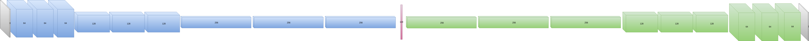
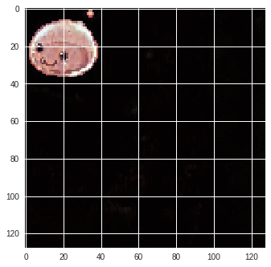
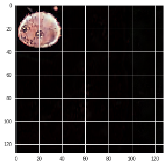
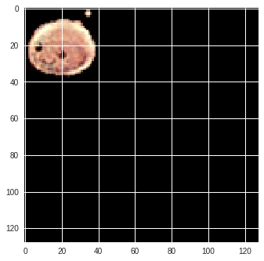
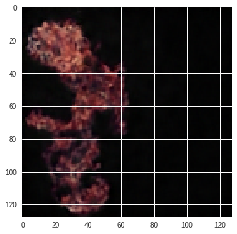

# Odin
Automatic generation of new monsters for Ragnarok Online

Model's codes are available in models/

You can directly try the Python notebooks in your Google colaboratory to experiment the models by yourself.  

I also plan to provide Python scripts soon.

## Plain Auto-Encoder

#### Model's architecture & other hyper-parameters

Auto-encoder's architecture:
* Encoder:
  * 3 convolutional blocks (1 block = [convolutional layer, batch normalization, ReLU activation] * 3)
  * Each block is followed by a max-pool operation that halves the spatial dimensions
  * Number of convolutional filters: 64 in the first block (doubled after each max-pooling operation)
  * fully-connected layer of 128 neurons (linear activation function)
* Decoder:
  * 3 convolutional blocks
  * Each block starts with a bilinear interpolation that doubles the spatial dimensions
  * Number of convolutional filters: 256 in the first block (halved after each bilinear interpolation operation)
  * A last convolutional layer with 3 kernels (linear activation function)

Other hyper-parameters:
* Loss function: Mean Squared Error (MSE)
* Optimizer: Adam
* Learning rate: Fixed to 0.001
* Mini-batch size: 32
* Number of training epochs: 2000

Images are normalized such that pixels values range between -1 and 1.

#### Example of images produced by a plain autoencoder

Interpolation between a Poring and a Metaling (left), Portaling(50% Poring/50% Metaling) (right) :

 

Interpolation between a Poring and Ifrit (left), Porfrit(30% Poring/70% Ifrit) (right) :

 

## More models soon...
